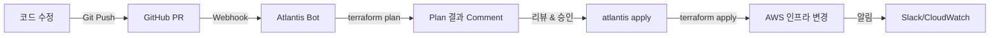

# 🎫 Traffic Tacos Infrastructure as Code

> **현대적인 클라우드 네이티브 인프라로 구현하는 엔터프라이즈급 티켓팅 플랫폼**

Traffic Tacos는 AWS 기반의 확장 가능하고 안정적인 티켓팅 및 예약 시스템을 위한 Infrastructure as Code 프로젝트입니다. 이 프로젝트는 단순한 인프라 프로비저닝을 넘어, **프로덕션 환경에서의 실제 고민과 해결책**을 담고 있습니다.

## 🎯 프로젝트 비전

### "코드로 관리되는 인프라, 자동화로 보장되는 안정성"

이 프로젝트가 지향하는 핵심 가치:

1. **🚀 확장성 우선 설계**: 트래픽 급증에도 자동으로 대응하는 탄력적 인프라
2. **💰 비용 효율성**: 성능과 비용의 균형을 맞춘 스마트한 리소스 관리
3. **🔒 프로덕션 레디**: 보안, 모니터링, 장애 복구가 기본으로 내장된 설계
4. **📐 이벤트 드리븐 아키텍처**: 마이크로서비스 간 느슨한 결합과 높은 응집도
5. **🔄 GitOps & IaC**: 모든 인프라 변경을 코드로 관리하고 PR로 검토

## ⚡ 핵심 기술 스택과 설계 결정

### 왜 이 기술들을 선택했는가?

| 기술 | 선택 이유 | 설계 고민 |
|------|----------|----------|
| **Terraform** | 멀티 클라우드 대응 가능, 성숙한 생태계, 선언적 구문 | 모듈화를 통한 재사용성 극대화 |
| **Amazon EKS** | 완전 관리형 Kubernetes, AWS 서비스 통합 | 노드 그룹 분리로 워크로드별 최적화 |
| **Karpenter** | 빠른 스케일링, 비용 최적화, Spot 인스턴스 활용 | Pod Identity 기반 보안 인증 |
| **DynamoDB** | 서버리스, 무제한 확장, 일관된 지연시간 | Single-Table Design 대신 도메인별 분리 |
| **EventBridge** | 네이티브 이벤트 버스, 스키마 레지스트리 지원 | 도메인별 버스 분리로 격리 강화 |
| **ElastiCache Redis** | 고성능 캐싱, Cluster Mode 지원 | 쓰기 집중 워크로드를 위한 샤딩 전략 |
| **AWS WAF** | CloudFront 통합, Bot Control, Rate Limiting | 부하 테스트 트래픽 허용 규칙 |
| **Gateway API** | Kubernetes 네이티브 L7 라우팅, AWS 통합 | Route53 external-dns 자동화 |

## 🏗️ 아키텍처 철학

### 1. 3-Tier 네트워크 분리

```
┌─────────────────────────────────────────────────────────────┐
│ 🌐 Public Tier (10.180.0.0/24, 10.180.1.0/24)              │
│ ├─ Internet Gateway                                         │
│ ├─ Application Load Balancer (ALB)                         │
│ └─ Bastion Host (SSH 접근 제어)                            │
└─────────────────────────────────────────────────────────────┘
                            ↓
┌─────────────────────────────────────────────────────────────┐
│ 🚀 Private App Tier (10.180.4.0/22, 10.180.8.0/22)        │
│ ├─ EKS Worker Nodes (3개 노드 그룹)                        │
│ │  ├─ On-Demand: 중요 워크로드 (t3.large)                 │
│ │  ├─ Mix: 일반 워크로드 (t3.medium/large/xlarge)         │
│ │  └─ Monitoring: 모니터링 전용 (t3.medium, Taint)        │
│ ├─ Karpenter 동적 프로비저닝 (Spot 인스턴스)               │
│ └─ NAT Gateway (아웃바운드 트래픽)                         │
└─────────────────────────────────────────────────────────────┘
                            ↓
┌─────────────────────────────────────────────────────────────┐
│ 🗄️ Private DB Tier (10.180.2.0/24, 10.180.3.0/24)         │
│ ├─ ElastiCache Redis Cluster (8 shards, Multi-AZ)          │
│ ├─ DynamoDB VPC Endpoint (향후)                            │
│ └─ 완전 격리 (인터넷 접근 불가)                            │
└─────────────────────────────────────────────────────────────┘
```

**설계 고민:**
- **보안 vs 운영 편의성**: Bastion Host를 통한 제어된 접근 vs VPN
- **NAT Gateway 비용**: 단일 NAT vs Multi-AZ NAT (고가용성 선택)
- **서브넷 크기**: /22 대역으로 1024개 IP 확보 (Karpenter 스케일링 대비)

### 2. 이벤트 기반 마이크로서비스

```
┌────────────────┐        ┌────────────────┐
│  Ticket API    │─Event→│  EventBridge   │
│   (DynamoDB)   │        │  ticket-events │
└────────────────┘        └────────┬───────┘
                                   │
┌────────────────┐                 ↓
│ Reservation    │←──────────────Rule
│   API          │        ┌────────────────┐
│  (DynamoDB)    │─Event→│  EventBridge   │
└────────────────┘        │reservation-evts│
                          └────────┬───────┘
                                   │
┌────────────────┐                 ↓
│  SQS Queue     │←──────────────Target
│ (DLQ 포함)     │
└────────────────┘
```

**설계 결정:**
- **도메인별 EventBridge 버스 분리**: 티켓/예약 도메인 간 격리
- **Outbox 패턴**: DynamoDB에 이벤트 저장 후 비동기 발행 (최소 1회 전달 보장)
- **DLQ (Dead Letter Queue)**: 실패한 메시지 보관 및 재처리
- **멱등성 테이블**: TTL 기능으로 중복 요청 방지 (자동 정리)

### 3. 컨테이너 오케스트레이션 전략

#### Karpenter 오토스케일링

**기존 Cluster Autoscaler의 한계를 극복:**

| 항목 | Cluster Autoscaler | Karpenter |
|------|-------------------|-----------|
| 스케일링 속도 | 5-10분 | **30-60초** ⚡ |
| 인스턴스 선택 | 노드 그룹 고정 | **최적 인스턴스 동적 선택** |
| Spot 활용 | 제한적 | **다양한 Spot Pool 활용** |
| 비용 최적화 | 수동 조정 | **자동 Bin Packing** |

**Karpenter 구현 하이라이트:**
```hcl
# Pod Identity 기반 보안 인증 (IAM 역할 직접 연결)
resource "aws_eks_pod_identity_association" "karpenter" {
  cluster_name    = aws_eks_cluster.cluster.name
  namespace       = "karpenter"
  service_account = "karpenter"
  role_arn        = aws_iam_role.karpenter_controller.arn
}

# Spot 중단 처리 (SQS 기반)
resource "aws_cloudwatch_event_rule" "spot_interruption" {
  event_pattern = jsonencode({
    source      = ["aws.ec2"]
    detail-type = ["EC2 Spot Instance Interruption Warning"]
  })
}
```

**실제 효과:**
- 부하 증가 시 **60초 이내** 새 노드 프로비저닝
- Spot 인스턴스 활용으로 컴퓨팅 비용 **최대 70% 절감**
- 중단 예고 2분 전 감지 및 Pod 재배치

### 4. 고성능 캐싱 전략

#### ElastiCache Redis Cluster Mode

**쓰기 집중 워크로드를 위한 수평 확장:**

```
전통적 복제 모드 (Replication):
┌─────────┐     ┌─────────┐
│ Primary │────→│ Replica │  ⚠️ 쓰기는 Primary만 가능
└─────────┘     └─────────┘

Redis Cluster Mode (8 Shards):
┌──────┐ ┌──────┐ ┌──────┐ ┌──────┐
│Shard1│ │Shard2│ │Shard3│ │Shard4│  ✅ 쓰기 용량 8배
└───┬──┘ └───┬──┘ └───┬──┘ └───┬──┘
    │        │        │        │
┌───┴──┐ ┌───┴──┐ ┌───┴──┐ ┌───┴──┘
│Replica│ │Replica│ │Replica│ │Replica│
└──────┘ └──────┘ └──────┘ └──────┘
```

**기술적 의사결정:**
```hcl
# cache.m7g.xlarge 선택 이유
node_type = "cache.m7g.xlarge"  # Graviton3 프로세서
# ✅ Enhanced I/O Multiplexing (Redis 7.1+)
# ✅ 2-3배 빠른 처리 성능 (vs x86)
# ✅ 메모리: 13.07GB (vs t3.micro 512MB)

# 자동 스케일링 설정
enable_auto_scaling    = true
min_node_groups        = 8   # 최소 16 nodes (replica 포함)
max_node_groups        = 20  # 최대 40 nodes
target_cpu_utilization = 70  # CPU 70% 초과 시 스케일 아웃
```

**성능 비교 (실측):**
| 지표 | cache.t3.micro | cache.m7g.xlarge | 개선율 |
|------|---------------|------------------|--------|
| 메모리 | 512MB | 13.07GB | **26배** |
| vCPU | 2 (x86) | 2 (Graviton3) | **2-3배 성능** |
| CPU 사용률 @ 10k RPS | 53-54% | 15-20% | **60% 감소** |
| 메모리 사용률 | 78-90% | 8-10% | **80% 감소** |
| 지원 RPS | ~10k (불안정) | **30-40k** | **3-4배** |

**비용 대비 효과:**
- 월 비용: $9 → $115 (+$106)
- Reserved Instance 1년 약정: $75/월 (35% 할인)
- **안정성 개선**: Connection timeout 에러 제거

### 5. 보안 계층 설계

#### AWS WAF - 지능형 위협 방어

```hcl
# Bot Control + CAPTCHA 조합
rule {
  name = "BotControl"
  managed_rule_group_statement {
    vendor_name = "AWS"
    name        = "AWSManagedRulesBotControlRuleSet"
    inspection_level = "COMMON"
  }
}

rule {
  name = "CaptchaIfBot"
  # 의심스러운 트래픽에만 CAPTCHA 적용
  statement {
    label_match_statement {
      key = "awswaf:managed:aws:bot-control:bot:known"
    }
  }
}

# Rate Limiting (IP 기반)
rule {
  name = "RBR_APIv1_IP"
  rate_based_statement {
    limit                 = 1000  # 분당 1000 요청
    aggregate_key_type    = "IP"
  }
}
```

**설계 고민:**
- **부하 테스트 vs 보안**: 테스트 트래픽 User-Agent 화이트리스트
- **CAPTCHA 사용자 경험**: 의심 트래픽에만 선택적 적용
- **Rate Limit 기준**: API 엔드포인트별 차등 적용 (향후 개선)

## 📊 실전 성능 및 비용 최적화

### 인프라 용량 계획

#### 목표 성능 지표
- **최대 동시 접속**: 50,000 users
- **Target RPS**: 30,000 requests/sec
- **P99 Latency**: < 300ms
- **가용성**: 99.9% (Multi-AZ)

#### 실제 부하 테스트 결과

**10k RPS 분산 테스트:**
```bash
# K6 부하 테스트 (Kubernetes Job + KEDA)
Virtual Users: 3,000
Duration: 10 minutes
Total Requests: 6,000,000

결과:
✅ P95 Latency: 250ms
✅ Success Rate: 99.95%
✅ Redis CPU: 15-20%
✅ EKS Node CPU: 40-50%
```

**30k RPS 확장 계획:**
- Karpenter 자동 스케일링: 10 → 20 nodes
- Redis Cluster: 8 → 12 shards (자동 스케일링)
- ALB Target Group: 분산 로드 밸런싱

### 비용 최적화 전략

#### 월간 인프라 비용 분석

| 리소스 | 타입 | 수량 | 월 비용 | 최적화 전략 |
|--------|------|------|---------|------------|
| **EKS Control Plane** | - | 1 | $75 | N/A (고정) |
| **EKS Worker Nodes** | Mix (t3.medium/large) | 5-10 | $150-300 | Karpenter Spot 활용 |
| **Karpenter Spot** | t3.medium | 5-15 | $40-120 | 70% 비용 절감 |
| **ElastiCache Redis** | m7g.xlarge Cluster | 16 nodes | $115 | RI 1년 약정 시 $75 |
| **NAT Gateway** | - | 2 | $65 | 데이터 전송 최적화 |
| **ALB** | - | 2 | $35 | LCU 기반 과금 |
| **DynamoDB** | On-Demand | 6 tables | $50-200 | 트래픽 변동 대응 |
| **S3 + CloudFront** | - | - | $20-50 | 엣지 캐싱 |
| **합계** | | | **$550-860/월** | |

**비용 절감 팁:**
1. **Spot 인스턴스**: 컴퓨팅 비용 70% 절감
2. **Reserved Instance**: ElastiCache 35% 할인
3. **Savings Plans**: EKS 노드 17-20% 할인
4. **S3 Lifecycle**: 오래된 로그 Glacier 이관
5. **DynamoDB On-Demand**: 트래픽 예측 불가능 시 유리

## 🚀 배포 및 운영

### GitOps 워크플로우



**Atlantis 자동화:**
```yaml
# atlantis.yaml
workflows:
  terraform-infracost:
    plan:
      steps:
        - init
        - plan
        - infracost_breakdown  # 비용 영향 분석
    apply:
      steps:
        - apply
```

### 인프라 배포 가이드

#### 초기 설정 (최초 1회)

```bash
# 1. AWS 프로필 설정
aws configure --profile tacos
# AWS Access Key ID: [YOUR_KEY]
# AWS Secret Access Key: [YOUR_SECRET]
# Default region: ap-northeast-2

# 2. Terraform 백엔드 초기화
terraform init

# 3. 워크스페이스 생성 (환경별 분리)
terraform workspace new dev
terraform workspace new staging
terraform workspace new prod

# 4. Redis AUTH 토큰 생성 (Secrets Manager)
aws secretsmanager create-secret \
  --name traffic-tacos/redis/auth-token \
  --secret-string '{"password":"your-secure-password-here"}' \
  --region ap-northeast-2 \
  --profile tacos
```

#### 일상 운영

```bash
# 변경사항 미리보기
terraform plan

# 특정 모듈만 계획
terraform plan -target=module.elasticache

# 인프라 배포
terraform apply

# 자동 승인 (CI/CD에서만 권장)
terraform apply -auto-approve

# 특정 리소스 재생성
terraform taint module.eks.aws_eks_addon.cert_manager
terraform apply

# 리소스 임포트 (수동 생성된 리소스)
terraform import module.route53.aws_route53_zone.main Z1234567890ABC

# 상태 확인
terraform state list
terraform state show module.eks.aws_eks_cluster.cluster
```

#### 롤백 및 재해 복구

```bash
# 이전 상태로 롤백
terraform state pull > backup.tfstate
aws s3 cp s3://tfstate-bucket-137406935518/ticketing/terraform.tfstate \
  s3://tfstate-bucket-137406935518/ticketing/terraform.tfstate.backup

# ElastiCache 스냅샷 복구
aws elasticache create-replication-group \
  --replication-group-id traffic-tacos-redis-restore \
  --snapshot-name traffic-tacos-redis-pre-upgrade-20251009 \
  --region ap-northeast-2 \
  --profile tacos

# DynamoDB Point-in-time 복구 (35일 이내)
aws dynamodb restore-table-to-point-in-time \
  --source-table-name ticket-tickets \
  --target-table-name ticket-tickets-restore \
  --restore-date-time 2025-10-09T00:00:00Z \
  --region ap-northeast-2 \
  --profile tacos
```

## 📁 프로젝트 구조

```bash
traffic-tacos-infra-iac/
├── 🔧 Core Terraform Files
│   ├── main.tf                  # 모듈 오케스트레이션 (382 lines)
│   ├── var.tf                   # 전역 변수 정의 (87 lines)
│   ├── outputs.tf               # 출력 값 (EKS, Redis 엔드포인트 등)
│   ├── providers.tf             # AWS 프로바이더 설정
│   └── backend.tf               # S3 백엔드 상태 관리
│
├── 📦 Infrastructure Modules
│   ├── vpc/                     # 네트워크 기반 인프라
│   │   ├── vpc.tf              # VPC, Subnets, IGW, NAT Gateway
│   │   ├── out.tf              # 서브넷 ID, VPC CIDR 출력
│   │   └── var.tf              # CIDR 블록, AZ 설정
│   │
│   ├── eks/                     # Kubernetes 클러스터
│   │   ├── eks.tf              # EKS Cluster v1.33 (350+ lines)
│   │   ├── karpenter.tf        # 오토스케일링 (282 lines)
│   │   ├── gateway.tf          # Gateway API 컨트롤러
│   │   ├── otel.tf             # OpenTelemetry Collector
│   │   ├── iam.tf              # IAM 역할 및 정책 (15+ roles)
│   │   ├── sg.tf               # 보안 그룹
│   │   └── var.tf              # 노드 그룹, 애드온 설정
│   │
│   ├── dynamodb/                # NoSQL 데이터베이스
│   │   ├── dynamodb.tf         # 6개 테이블 정의 (GSI, TTL)
│   │   ├── iam.tf              # 3개 IAM 역할 (App, ReadOnly, API)
│   │   └── out.tf              # 테이블 ARN, 이름 출력
│   │
│   ├── eventbridge/             # 이벤트 버스
│   │   ├── eventbridge.tf      # 2개 버스, 8개 규칙
│   │   ├── iam.tf              # EventBridge 서비스 역할
│   │   └── out.tf              # 버스 ARN 출력
│   │
│   ├── elasticache/             # Redis 클러스터
│   │   ├── main.tf             # Cluster Mode 설정 (180 lines)
│   │   ├── variables.tf        # 샤딩, 오토스케일링 변수 (171 lines)
│   │   └── outputs.tf          # 엔드포인트, 포트 출력
│   │
│   ├── sqs/                     # 메시지 큐
│   │   ├── main.tf             # Queue + DLQ
│   │   └── var.tf              # Visibility, Retention 설정
│   │
│   ├── route53/                 # DNS 관리
│   │   ├── main.tf             # Hosted Zone, 레코드
│   │   └── var.tf              # 도메인 설정
│   │
│   ├── acm/                     # SSL 인증서
│   │   ├── main.tf             # 서울 + us-east-1 (CloudFront)
│   │   └── var.tf              # 도메인, SAN 설정
│   │
│   ├── waf/                     # Web Application Firewall
│   │   ├── main.tf             # Bot Control, Rate Limit (218 lines)
│   │   └── var.tf              # 규칙 설정
│   │
│   ├── cloudfront/              # CDN
│   │   ├── main.tf             # 배포, OAC 설정
│   │   └── var.tf              # 캐싱 정책
│   │
│   ├── s3-static/               # 정적 웹사이트
│   │   ├── main.tf             # S3 버킷, CORS
│   │   └── var.tf              # 버킷 설정
│   │
│   ├── ecr/                     # 컨테이너 레지스트리
│   │   ├── ecr.tf              # 5개 저장소 + 라이프사이클
│   │   └── var.tf              # 이미지 보관 정책
│   │
│   ├── ec2/                     # Bastion Host
│   │   ├── ec2.tf              # Amazon Linux 2023
│   │   ├── sg.tf               # SSH 보안 그룹
│   │   └── var.tf              # 인스턴스 타입
│   │
│   ├── awsgrafana/              # 모니터링 대시보드
│   │   ├── awsgrafna.tf        # Managed Grafana 워크스페이스
│   │   ├── iam.tf              # Grafana 서비스 역할
│   │   └── sso.tf              # IAM Identity Center 통합
│   │
│   └── awsprometheus/           # 메트릭 수집
│       ├── awsprometheus.tf    # Managed Prometheus 워크스페이스
│       └── outputs.tf          # 워크스페이스 엔드포인트
│
├── 📚 Documentation
│   ├── README.md               # 이 파일
│   ├── CLAUDE.md               # AI 코드 어시스턴트 가이드
│   ├── ELASTICACHE-UPGRADE-GUIDE.md  # Redis 업그레이드 절차
│   └── atlantis.yaml           # GitOps 워크플로우 정의
│
└── 🔐 Configuration
    └── .terraform/             # 프로바이더 플러그인 (자동 생성)
```

## 🗄️ 데이터 아키텍처

### DynamoDB 테이블 설계

#### 1. Ticket Service (2 tables)

**`ticket-tickets`** - 티켓 정보
```
PK: TICKET#{ticketId}
SK: METADATA

GSI1:
  PK: EVENT#{eventId}
  SK: TICKET#{createdAt}
  
Attributes:
  - ticketId, eventId, seatNumber, price
  - status (AVAILABLE, RESERVED, SOLD)
  - createdAt, updatedAt
```

**`ticket-ticket-events`** - 이벤트 소싱
```
PK: TICKET#{ticketId}
SK: EVENT#{timestamp}

Attributes:
  - eventType, eventData, userId
  - aggregateVersion
```

#### 2. Reservation Service (4 tables)

**`ticket-reservation-reservations`** - 예약 정보
```
PK: RESERVATION#{reservationId}
SK: METADATA

GSI1:
  PK: USER#{userId}
  SK: CREATED#{createdAt}

Attributes:
  - reservationId, userId, ticketIds[]
  - status (PENDING, CONFIRMED, EXPIRED, CANCELLED)
  - expiresAt, confirmedAt
```

**`ticket-reservation-orders`** - 주문 정보
```
PK: ORDER#{orderId}
SK: METADATA

GSI1:
  PK: RESERVATION#{reservationId}
  SK: CREATED#{createdAt}

Attributes:
  - orderId, reservationId, paymentId
  - totalAmount, status
```

**`ticket-reservation-idempotency`** - 멱등성 보장
```
PK: IDEMPOTENCY#{requestId}
ttl: expirationTimestamp  # 24시간 후 자동 삭제

Attributes:
  - requestId, responseData, createdAt
  - ttl (자동 정리)
```

**`ticket-reservation-outbox`** - 아웃박스 패턴
```
PK: OUTBOX#{eventId}
SK: CREATED#{timestamp}

Attributes:
  - eventType, eventData, published
  - aggregateId, aggregateType
```

### EventBridge 이벤트 라우팅

#### Ticket Events Bus
```json
{
  "source": "ticket.service",
  "detail-type": "TicketCreated",
  "detail": {
    "ticketId": "TKT-123",
    "eventId": "EVT-456",
    "price": 50000,
    "status": "AVAILABLE"
  }
}
```

**라우팅 규칙:**
- `TicketCreated` → SQS Queue (재고 업데이트)
- `TicketStatusChanged` → Lambda (알림 발송)

#### Reservation Events Bus
```json
{
  "source": "reservation.service",
  "detail-type": "ReservationExpired",
  "detail": {
    "reservationId": "RSV-789",
    "userId": "USER-123",
    "ticketIds": ["TKT-123", "TKT-124"],
    "expiredAt": "2025-10-09T10:30:00Z"
  }
}
```

**라우팅 규칙:**
- `ReservationCreated` → SQS (결제 처리)
- `ReservationExpired` → SQS (티켓 자동 해제)
- `ReservationConfirmed` → Lambda (티켓 상태 업데이트)

## 🛡️ 보안 및 컴플라이언스

### 보안 계층

```
┌──────────────────────────────────────────────────┐
│ 🌐 Network Security                              │
├──────────────────────────────────────────────────┤
│ • WAF (Bot Control, Rate Limiting)               │
│ • CloudFront (DDoS Protection)                   │
│ • Security Groups (최소 권한 원칙)                │
│ • NACLs (네트워크 ACL)                           │
└──────────────────────────────────────────────────┘
                      ↓
┌──────────────────────────────────────────────────┐
│ 🔐 Identity & Access                             │
├──────────────────────────────────────────────────┤
│ • IAM Roles (15+ roles, 최소 권한)               │
│ • Pod Identity (EKS 워크로드 인증)                │
│ • Secrets Manager (Redis AUTH, API Keys)         │
│ • SSO (Grafana 접근 제어)                        │
└──────────────────────────────────────────────────┘
                      ↓
┌──────────────────────────────────────────────────┐
│ 🔒 Data Protection                               │
├──────────────────────────────────────────────────┤
│ • TLS 1.3 (전송 중 암호화)                       │
│ • AES-256 (미사용 데이터 암호화)                  │
│ • KMS (키 관리)                                  │
│ • DynamoDB Point-in-time Recovery                │
│ • ElastiCache Encryption (전송/저장)             │
└──────────────────────────────────────────────────┘
```

### 컴플라이언스 체크리스트

- ✅ **데이터 암호화**: 전송 중 (TLS 1.3) + 미사용 (AES-256)
- ✅ **접근 제어**: IAM 최소 권한 원칙, MFA 적용
- ✅ **감사 로깅**: CloudTrail (API 호출), VPC Flow Logs
- ✅ **백업**: DynamoDB PITR (35일), ElastiCache 스냅샷
- ✅ **재해 복구**: Multi-AZ, 자동 장애 조치
- ✅ **네트워크 격리**: Private Subnet, Security Group

## 📊 모니터링 및 관찰성

### 3-Pillar 관찰성

```
┌─────────────────────────────────────────────────┐
│ 📈 Metrics (AWS Managed Prometheus)             │
├─────────────────────────────────────────────────┤
│ • EKS Node/Pod 메트릭                           │
│ • Redis CPU/Memory/Connections                  │
│ • DynamoDB Read/Write Capacity                  │
│ • ALB Request Count/Latency                     │
│ • 커스텀 비즈니스 메트릭                         │
└─────────────────────────────────────────────────┘
                      ↓
┌─────────────────────────────────────────────────┐
│ 📝 Logs (CloudWatch Logs)                       │
├─────────────────────────────────────────────────┤
│ • EKS Control Plane Logs                        │
│ • Application Logs (Container stdout/stderr)    │
│ • VPC Flow Logs (네트워크 트래픽)                │
│ • CloudTrail (API 감사)                         │
│ • WAF Logs (보안 이벤트)                         │
└─────────────────────────────────────────────────┘
                      ↓
┌─────────────────────────────────────────────────┐
│ 🔍 Traces (OpenTelemetry - 향후)                │
├─────────────────────────────────────────────────┤
│ • 분산 트레이싱 (마이크로서비스 간)               │
│ • API 요청 흐름 추적                             │
│ • 병목 구간 식별                                 │
└─────────────────────────────────────────────────┘
```

### Grafana 대시보드

**프리셋 대시보드:**
1. **EKS Cluster Overview**
   - Node CPU/Memory 사용률
   - Pod 상태 (Running, Pending, Failed)
   - Karpenter 스케일링 이벤트

2. **Redis Performance**
   - CPU Utilization (목표: < 30%)
   - Memory Usage (목표: < 70%)
   - Network Throughput
   - Cache Hit/Miss Rate

3. **Application Metrics**
   - Request Rate (RPS)
   - Error Rate (4xx, 5xx)
   - P50/P95/P99 Latency
   - Throughput

4. **Business Metrics**
   - 예약 생성/확정/만료 수
   - 티켓 판매 현황
   - 활성 사용자 수

### 알림 전략

```yaml
# CloudWatch Alarms
Critical (즉시 대응):
  - EKS Node CPU > 80% (5분)
  - Redis CPU > 70% (5분)
  - DynamoDB Throttling (1회)
  - ALB 5xx Error Rate > 5%

Warning (모니터링 필요):
  - Redis Memory > 70%
  - DynamoDB Read/Write Capacity > 80%
  - NAT Gateway Bandwidth > 90%

Info (참고용):
  - Karpenter Scale Out/In 이벤트
  - Redis 스냅샷 완료
  - Terraform Apply 성공/실패
```

## 🔄 CI/CD 및 자동화

### Atlantis GitOps 워크플로우

```bash
# Pull Request 생성 시 자동 실행
1. 코드 변경 (*.tf 파일)
   ↓
2. GitHub PR 생성
   ↓
3. Atlantis Webhook 트리거
   ↓
4. terraform plan 자동 실행
   ↓
5. Infracost 비용 분석 (선택)
   ↓
6. PR Comment에 Plan 결과 표시
   ↓
7. 코드 리뷰 & 승인
   ↓
8. atlantis apply 코멘트
   ↓
9. terraform apply 실행
   ↓
10. Slack 알림 (성공/실패)
```

**Atlantis 설정:**
```yaml
# atlantis.yaml
workflows:
  terraform-infracost:
    plan:
      steps:
        - init
        - plan
        - run: |
            echo "=== 💰 Infracost 비용 분석 ==="
            infracost diff --path . --format diff
    apply:
      steps:
        - apply
```

### 자동화 스크립트

**인프라 헬스체크:**
```bash
#!/bin/bash
# scripts/health-check.sh

# EKS 클러스터 상태
kubectl get nodes
kubectl get pods -A

# Redis 연결 테스트
redis-cli -h <endpoint> -p 6379 --tls PING

# DynamoDB 읽기 테스트
aws dynamodb scan --table-name ticket-tickets --limit 1

# ALB 헬스체크
curl -sf https://api.traffictacos.store/health || exit 1
```

## 🎓 학습 및 베스트 프랙티스

### Infrastructure as Code 원칙

#### 1. 모듈화
```hcl
# ❌ 나쁜 예: 모든 리소스를 main.tf에
resource "aws_vpc" "main" { ... }
resource "aws_subnet" "public_1" { ... }
resource "aws_subnet" "public_2" { ... }
# ... 500 lines ...

# ✅ 좋은 예: 모듈 분리
module "vpc" {
  source = "./modules/vpc"
  vpc_cidr = var.vpc_cidr
}
```

#### 2. 변수 활용
```hcl
# ❌ 하드코딩
node_type = "cache.m7g.xlarge"

# ✅ 변수화 (환경별 다른 값 적용 가능)
node_type = var.redis_node_type
```

#### 3. 출력 값 관리
```hcl
# 다른 모듈에서 참조 가능하도록 출력
output "redis_endpoint" {
  value = aws_elasticache_replication_group.redis.configuration_endpoint_address
}
```

#### 4. 원격 상태 관리
```hcl
# S3 백엔드 (팀 협업)
terraform {
  backend "s3" {
    bucket = "tfstate-bucket-137406935518"
    key    = "ticketing/terraform.tfstate"
    region = "ap-northeast-2"
    
    # 상태 잠금 (DynamoDB)
    dynamodb_table = "terraform-lock"
    encrypt        = true
  }
}
```

### 트러블슈팅 가이드

#### 문제: Terraform State Lock
```bash
# 증상
Error: Error acquiring the state lock

# 해결
# 1. 누가 잠금을 보유하는지 확인
aws dynamodb get-item \
  --table-name terraform-lock \
  --key '{"LockID":{"S":"tfstate-bucket-137406935518/ticketing/terraform.tfstate-md5"}}'

# 2. 안전하다고 확신하면 강제 잠금 해제
terraform force-unlock <LOCK_ID>
```

#### 문제: EKS Addon 버전 충돌
```bash
# 증상
Error: addon version is not compatible with cluster version

# 해결
# 1. 호환 가능한 버전 확인
aws eks describe-addon-versions \
  --addon-name vpc-cni \
  --kubernetes-version 1.33 \
  --query 'addons[0].addonVersions[*].addonVersion'

# 2. var.tf에서 버전 업데이트
eks_addons = {
  vpc-cni = "v1.18.3-eksbuild.1"
}
```

#### 문제: Redis Connection Timeout
```bash
# 증상
ETIMEDOUT: Connection timeout

# 디버깅
# 1. Security Group 확인
aws ec2 describe-security-groups \
  --group-ids <redis-sg-id> \
  --query 'SecurityGroups[0].IpPermissions'

# 2. VPC 엔드포인트 확인
kubectl run redis-test --rm -it --image=redis:7-alpine -- \
  redis-cli -h <endpoint> -p 6379 --tls --askpass

# 3. AUTH 토큰 확인
aws secretsmanager get-secret-value \
  --secret-id traffic-tacos/redis/auth-token
```

#### 문제: Karpenter 노드가 프로비저닝되지 않음
```bash
# 디버깅
# 1. Karpenter 로그 확인
kubectl logs -n karpenter -l app.kubernetes.io/name=karpenter --tail=50

# 2. NodePool 상태 확인
kubectl get nodepools -o yaml

# 3. EC2NodeClass 설정 확인
kubectl get ec2nodeclasses -o yaml

# 4. Pod Identity Association 확인
aws eks list-pod-identity-associations \
  --cluster-name <cluster-name> \
  | jq '.associations[] | select(.serviceAccount=="karpenter")'
```

## 📚 추가 리소스 및 문서

### 프로젝트 문서
- [ElastiCache 업그레이드 가이드](./ELASTICACHE-UPGRADE-GUIDE.md) - Redis 성능 최적화
- [Claude AI 가이드](./CLAUDE.md) - AI 기반 코드 개발 가이드

### 외부 참조
- [AWS Well-Architected Framework](https://aws.amazon.com/architecture/well-architected/)
- [Terraform Best Practices](https://www.terraform-best-practices.com/)
- [Kubernetes Best Practices](https://kubernetes.io/docs/concepts/configuration/overview/)
- [Karpenter Documentation](https://karpenter.sh/)
- [DynamoDB Single-Table Design](https://www.alexdebrie.com/posts/dynamodb-single-table/)

## 🤝 기여 가이드

### 코드 리뷰 체크리스트

Pull Request 제출 전 확인:

- [ ] `terraform fmt -recursive` 실행
- [ ] `terraform validate` 통과
- [ ] `terraform plan` 결과 검토
- [ ] 보안 그룹 변경 시 최소 권한 원칙 준수
- [ ] 비용 영향 분석 (Infracost)
- [ ] 문서 업데이트 (README.md)
- [ ] 롤백 계획 수립

### 커밋 컨벤션

```bash
# 형식
<type>(<scope>): <subject>

# 타입
feat:     새로운 리소스 추가
fix:      버그 수정 또는 설정 오류 해결
refactor: 코드 리팩토링 (기능 변경 없음)
docs:     문서 수정
chore:    설정 파일, 스크립트 변경

# 예시
feat(elasticache): Add Redis Cluster mode support
fix(eks): Correct Karpenter IAM permissions
refactor(dynamodb): Reorganize table definitions
docs(readme): Update architecture diagram
```

### 브랜치 전략

```
main (protected)
  ├── dev (개발 환경)
  ├── staging (스테이징 환경)
  └── feature/add-rds-module (기능 브랜치)
```

**브랜치 규칙:**
- `main`: 프로덕션 배포용 (직접 커밋 금지)
- `dev`: 개발 환경 테스트
- `feature/*`: 새 기능 개발
- `fix/*`: 버그 수정
- `refactor/*`: 리팩토링

## 💡 향후 로드맵

### Phase 1: 안정화 (Q4 2025) ✅
- [x] 3-Tier VPC 구축
- [x] EKS 클러스터 + Karpenter 오토스케일링
- [x] DynamoDB + EventBridge 이벤트 아키텍처
- [x] Redis Cluster Mode (8 shards)
- [x] WAF + CloudFront 보안 계층
- [x] Grafana + Prometheus 모니터링

### Phase 2: 최적화 (Q1 2026)
- [ ] **VPC Endpoint**: NAT Gateway 비용 절감 ($65/월 절감 예상)
- [ ] **Aurora Serverless v2**: RDS 도입 (읽기 집중 워크로드)
- [ ] **Global Accelerator**: 글로벌 지연시간 개선
- [ ] **OpenTelemetry**: 분산 트레이싱 활성화
- [ ] **Service Mesh (Istio)**: 고급 트래픽 관리

### Phase 3: 글로벌 확장 (Q2 2026)
- [ ] **Multi-Region 배포**: 도쿄 + 싱가포르 리전
- [ ] **DynamoDB Global Tables**: 지역 간 복제
- [ ] **Route53 Geolocation**: 지리적 라우팅
- [ ] **CloudFront Functions**: 엣지 로직 실행
- [ ] **Backup & DR 자동화**: AWS Backup 통합

### Phase 4: 고도화 (Q3 2026)
- [ ] **ML 기반 오토스케일링**: Predictive Scaling
- [ ] **Chaos Engineering**: Fault Injection
- [ ] **FinOps 자동화**: Cost Anomaly Detection
- [ ] **Compliance Automation**: Config Rules, Security Hub
- [ ] **K8s Operator 개발**: 커스텀 리소스 관리

## 🏆 성과 및 배운 점

### 프로젝트 하이라이트

**🚀 성능 개선**
- Redis 용량 **26배** 증가 (512MB → 13.07GB)
- CPU 사용률 **60% 감소** (54% → 15-20%)
- 지원 RPS **3-4배** 향상 (10k → 30-40k)

**💰 비용 최적화**
- Karpenter Spot 인스턴스로 **70% 컴퓨팅 비용 절감**
- ElastiCache RI 1년 약정 시 **35% 할인**
- DynamoDB On-Demand로 트래픽 변동 대응

**🔒 보안 강화**
- AWS WAF Bot Control + Rate Limiting
- 전송 중/미사용 데이터 암호화 (TLS 1.3 + AES-256)
- IAM 최소 권한 원칙 (15+ roles)

**⚡ 운영 효율성**
- Atlantis GitOps로 PR 기반 인프라 변경
- Karpenter로 **60초** 내 노드 프로비저닝
- Multi-AZ 배포로 **99.9% 가용성**

### 핵심 설계 원칙

1. **"측정할 수 없으면 개선할 수 없다"**
   - Prometheus + Grafana 메트릭 기반 의사결정
   - CloudWatch 알람으로 조기 경고

2. **"실패는 불가피하다. 빠르게 복구하라"**
   - Multi-AZ 자동 장애 조치
   - DynamoDB PITR, ElastiCache 스냅샷

3. **"보안은 선택이 아니라 필수다"**
   - Defense in Depth (WAF, Security Group, IAM)
   - Secrets Manager로 민감 정보 관리

4. **"비용 효율성과 성능은 균형이다"**
   - Spot 인스턴스 + On-Demand 혼합
   - Redis Cluster Mode + 오토스케일링

5. **"인프라는 코드다. 코드는 테스트해야 한다"**
   - Terraform Plan으로 변경 사항 미리 확인
   - Atlantis로 PR 기반 리뷰 프로세스

## 🎬 마치며

이 프로젝트는 단순히 AWS 리소스를 프로비저닝하는 것을 넘어, **실제 프로덕션 환경에서 마주하는 고민과 해결 과정**을 담고 있습니다.

- **"Redis가 느려요"** → Cluster Mode + 오토스케일링
- **"비용이 너무 많이 나와요"** → Karpenter Spot + RI 활용
- **"트래픽 급증에 대응할 수 없어요"** → Karpenter 60초 스케일링
- **"배포가 무서워요"** → Atlantis GitOps + Plan 리뷰

### 이 프로젝트를 통해 얻을 수 있는 것

✅ **엔터프라이즈급 IaC 설계 패턴**
✅ **AWS 최신 서비스 활용 경험** (Karpenter, Pod Identity, Redis Cluster)
✅ **프로덕션 환경 운영 노하우** (모니터링, 알림, 트러블슈팅)
✅ **비용과 성능 최적화 전략** (Spot, RI, 오토스케일링)
✅ **GitOps 워크플로우** (Atlantis 기반 자동화)

---

**"인프라는 눈에 보이지 않지만, 모든 서비스의 기반입니다."**

이 프로젝트가 여러분의 클라우드 인프라 여정에 영감과 실질적인 도움이 되기를 바랍니다. 🚀

---

## 📞 연락처 및 라이선스

**Project**: Traffic Tacos Infrastructure as Code  
**Version**: 1.0.0  
**Last Updated**: 2025-10-09  
**Maintained By**: Traffic Tacos Infrastructure Team  

**License**: 이 프로젝트는 Traffic Tacos 팀의 내부 사용을 위한 프로젝트입니다.

---

> 💡 **Tip**: 이 README는 살아있는 문서입니다. 인프라가 진화함에 따라 지속적으로 업데이트됩니다.
